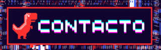

<td align="center">
  
</td>

<table>
    <tr>
        <td style="font-weight: bold; padding-right: 10px; vertical-align: center; border: none;">Backend:</td>
        <td></td>
    </tr>
    <tr>
        <td style="font-weight: bold; padding-right: 10px; vertical-align: center;">Frontend:</td>
        <td></td>
    </tr>
    <tr>
        <td style="font-weight: bold; padding-right: 10px; vertical-align: center; border: none;">Database:</td>
        <td></td>
    </tr>
    <tr>
        <td style="font-weight: bold; padding-right: 10px; vertical-align: center; border: none;">Version Control:</td>
        <td></td>
    </tr>
</table>
 

   

#### Programming Languages

 

 

 

(｡♥‿♥｡)¡𝙂𝙧𝙖𝙘𝙞𝙖𝙨 𝙥𝙤𝙧 𝙫𝙞𝙨𝙞𝙩𝙖𝙧! 𝙉𝙤 𝙙𝙪𝙙𝙚𝙨 𝙚𝙣 𝙚𝙭𝙥𝙡𝙤𝙧𝙖𝙧 𝙢𝙞𝙨 𝙧𝙚𝙥𝙤𝙨𝙞𝙩𝙤𝙧𝙞𝙤𝙨 𝙮 𝙥𝙧𝙤𝙮𝙚𝙘𝙩𝙤𝙨. 𝙋𝙪𝙚𝙙𝙚𝙨 𝙖𝙮𝙪𝙙𝙖𝙧𝙢𝙚 𝙘𝙤𝙣 𝙙𝙤𝙣𝙖𝙘𝙞𝙤𝙣𝙚𝙨 𝙚𝙣 𝙚𝙡 𝙨𝙞𝙜𝙪𝙞𝙚𝙣𝙩𝙚 𝙗𝙤𝙩𝙤𝙣
👇👇👇👇👇👇👇👇👇👇👇👇👇

<a href="https://paypal.me/skyshoked" target="_blank">
  

  
